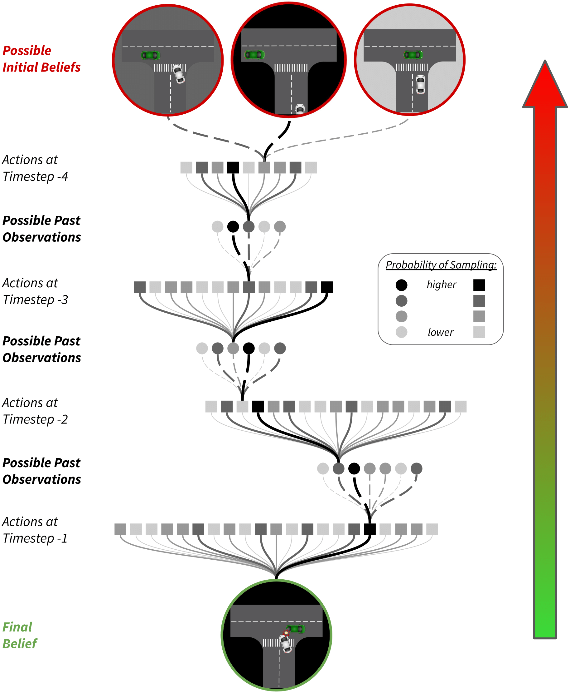

# Backward Monte Carlo Tree Search

Construct Monte Carlo trees **backward in time** to identify regions of the belief-space in Partially Observable Markov Decision Processes (POMDPs) that are **guaranteed to lead to a specified outcome** (e.g., failure or safety violation).

Backward Monte Carlo Tree Search (BMCTS) enables:
- Efficient exploration of unsafe belief regions
- Formal characterization of risk in belief-space
- Backward reasoning about future outcomes
- Integration with existing POMDP solvers

This package is integrated into the [POMDPs.jl](https://github.com/JuliaPOMDP/POMDPs.jl) ecosystem.

<p align="center">
  
</p>


## Publication

This repository contains the reference implementation for:

> Anil Yildiz, Esen Yel, Marcell Vazquez-Chanlatte, Kyle Wray, Mykel J. Kochenderfer, and Stefan J. Witwicki. 2026.  
> **Backward Monte Carlo Tree Search: Charting Unsafe Regions in the Belief-Space.**  
> *Journal of Artificial Intelligence Research* 85, Article 1 (January 2026), 37 pages.  
> doi: 10.1613/jair.1.18011

```bibtex
@article{yildiz2026backward,
  author  = {Yildiz, Anil and Yel, Esen and Vazquez-Chanlatte, Marcell and Wray, Kyle and Kochenderfer, Mykel J. and Witwicki, Stefan J.},
  title   = {Backward Monte Carlo Tree Search: Charting Unsafe Regions in the Belief-Space},
  journal = {Journal of Artificial Intelligence Research},
  volume  = {85},
  number  = {1},
  pages   = {1--37},
  year    = {2026},
  month   = jan,
  doi     = {10.1613/jair.1.18011}
}
```

## Installation

You first need to download and install [Julia](https://julialang.org/downloads/). This repo has been tested to run on Julia v1.6.3.

To install the package in this repo, in a Julia REPL, run the following lines:

```julia
using Pkg
pkg"add https://github.com/sisl/BackwardMCTS"
```

## Usage

To execute a backward MCTS for the partially observable GridWorld enviroment in the paper:

```bash
export JULIA_NUM_THREADS=num_of_threads    # parallelize Julia to multiple threads
cd src
julia run_benchmark_GridWorld.jl --threads num_of_threads
```
where `num_of_threads` is the maximum number of threads (e.g. 16) you would like to allocate (leave no space before or after the '=' symbol).


## Parameters
Below is the full list of arguments that can be passed in.

```julia
"--gridsize"
    arg_type = Int
    default = 8
    help = "Length of the an edge of the GridWorld (equal width and length)."

"--t_prob"
    arg_type = Float64
    default = 0.7
    help = "Probability of a correct transition."

"--o_prob"
    arg_type = Float64
    default = 0.9
    help = "Probability of a correct observation."

"--exploration_const"
    arg_type = Float64
    default = 0.1
    help = "Exploration constant `k_ucb` (Section A.2 in paper) during action selection."

"--z_dist_exp_const"
    arg_type = Float64
    default = 20.0
    help = "Exponential constant `k_z-exp` (Section A.4 in paper) to tune the steepness of the z-curve." 

"--threads"
    arg_type = Int
    default = 20
    help = "Simultaneous number of branches spawned across multiple threads. I.e. how many threads to use?"

"--sims_per_thread"
    arg_type = Int
    default = 10
    help = "How many branches should each thread spawn?"

"--max_timesteps"
    arg_type = Int
    default = 10
    help = "Maximum number of timesteps to go back in time while constructing the BackwardTree."

"--rollout_random"
    arg_type = Bool
    default = true
    help = "true: Select random action if rolling out; false: Select action with smallest linear program cost (computationally significantly more expensive!)."

"--val_epochs"
    arg_type = Int
    default = 10000
    help = "Number of epochs for forward simulations (during validation)."

"--noise_seed"
    arg_type = Int
    default = 149
    help = "Seed for RNG. Should be a prime number, due to how parallelization is setup across threads."

"--savename"
    arg_type = String
    default = "benchmarkRun_" * string(now())
    help = "Save name to locally save results. Any valid String accepted. Pass no arguments to skip saving."
```
